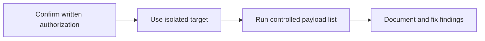

# Authorized WordPress XSS Auditor

<p align="center">
  <strong>A command-line payload runner for defensive testing in websites you own or are explicitly authorized to assess.</strong>
</p>

<p align="center">
  
  
  
</p>

## Overview

This utility helps a developer test a known input point against a controlled list of cross-site scripting payloads. It builds test URLs, runs payloads in a predictable sequence, and records successful observations for later review.

## The problem

Manually repeating controlled XSS checks is slow and makes it easy to lose track of payloads and results during authorized remediation work.

## The solution

The command-line workflow loads payload lists, constructs test URLs consistently, and separates result collection from the remediation process.

## What it demonstrates

- Defensive web-security tooling
- Command-line interface design
- URL construction and payload encoding
- Responsible scope documentation

## Core capabilities

| Capability | Practical value |
|---|---|
| Payload files | Loads curated text payloads while ignoring comments |
| URL templates | Supports a `{payload}` placeholder or query-value replacement |
| Optional encoding | Can URL-encode payload input |
| Result capture | Keeps successful observations for review |
| Terminal feedback | Provides readable run status |

## Workflow



## Technology

- Python
- Command-line arguments
- URL parsing and encoding
- Text-based payload sets

## Project status

**Security research utility**

Use only on systems you own or have explicit written permission to test. Do not use it against third-party websites. Run it in an isolated lab where possible. The author accepts no responsibility for unauthorized use.

## Run locally

```bash
git clone https://github.com/nasratulnayem/authorized-wordpress-xss-auditor.git
cd authorized-wordpress-xss-auditor
python -m venv .venv
source .venv/bin/activate
pip install -r requirements.txt
python run.py --help
```

## Usage

Start with a local WordPress lab and a deliberately vulnerable test input. Review every target and payload before running the tool.

## Engineering notes

- Configuration and credentials should be supplied through environment variables or local files excluded from Git.
- Generated output and runtime data should not be committed.
- Claims in this README describe the capabilities visible in this repository.
- Before production deployment, review authentication, rate limits, error handling, logging, and provider terms.

## Roadmap

- [ ] Add explicit allowlist enforcement
- [ ] Add a dry-run mode
- [ ] Add structured JSON reporting
- [ ] Replace raw result files with redacted sample fixtures

## About the developer

Built by **Nasratul Nayem**, a WordPress, WooCommerce, and automation developer based in Dhaka, Bangladesh.

I build practical systems that remove repetitive work: WordPress plugins, WooCommerce integrations, browser extensions, Python automation, AI-assisted content pipelines, and internal business tools.

- Portfolio: [nayem.dev](https://nayem.dev)
- GitHub: [@nasratulnayem](https://github.com/nasratulnayem)
- LinkedIn: [Nasratul Nayem](https://www.linkedin.com/in/nasratulnayem)

## License

Review the repository license before reuse. Third-party services and APIs remain subject to their own terms.
